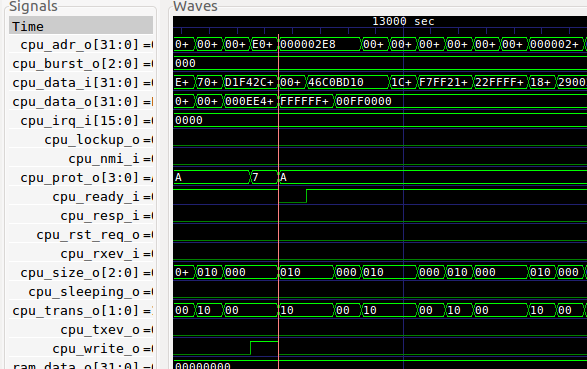

The M0 experiment
=================

A quick and dirty test to see if we can simulate and run ARM Cortex-M0 using
only open source tools (iverilog, gtkwave, GCC).

*Please note that you will need access to ARM IP for this experiment.*

Usage
-----

To setup the system, copy the ARM IP to hw/src/ip/cpu/ then execute::

    # this assumes you are using Ubuntu 16.04 or newer
    make setup

To build and simulate the hw-sw combination, run::

   make run

You should see an output like this::

   ...
   CPUID 410CC200
   THIS IS MAIN 00000399
   Existing by user request, code = d1e00d1e

To see the simulation waveform, run::

  make show

This should load gtkwave with a short simulation

