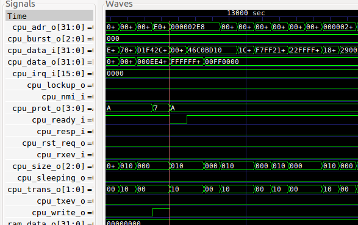

Setup and usage
===============

Before you start, copy the ARM IP to hw/src/cpu/ .
Then execute::

    make setup

This assumes you are using Ubuntu 16.04 or newer.
It will install the required tools then compile and install the yosys and related software.

Simulation
----------

We consider two types of simulations

* pre-synthesis: standard verilog simulation
* post-synthesis: simulation of the RTL code generated by the synthesis tool

The scripts refer to these as type 0 and type 1 simulation.

0: pre-synthesis
~~~~~~~~~~~~~~~~

Pre-synthesis simulation uses the fixture found in hw/src/sim0
and is initiated with the sim0 make target::

    # this will build the firmware, then the verilog simulation and then run it
    make sim0

You should see an output like this::

    ...
    CPUID 410CC200
    ....
    Existing by user request, code = d1e00d1e

To see the waveforms, run::

    make wave0

This should load gtkwave with a short simulation

1: post-synthesis
~~~~~~~~~~~~~~~~~

Post-synthesis simulation uses hw/build/m0.v (generated after synthesis)
together with the fixture found in hw/src/sim1. To start, run::

    # post-synthesis simulation
    make sim1

Similarly, the waveforms can be inspected using::

    make wave1

Synthesis
---------

To synthesize the design, run::

    make synth

To perform place-and-route, run::

    make par

For timing analysis, run::

    make time

To program the board with this bitstream, run::

   make program

Note that once programmed the device will be in reset state until you connect
to its serial interface. Simply run::

   make console

misc
----

For verilog linter, run::

    make lint
