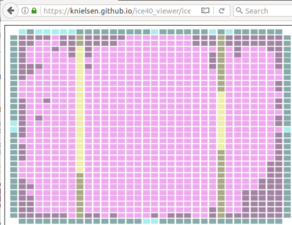

Performance
===========

Software
--------

Software performance is fine, nothing to see here :)

Hardware
--------

In hardware design performance generally means three things:

* Size (area in ASIC, device usage in FPGA)
* Frequency
* Power usage

Design size
~~~~~~~~~~~

Yosys resource utilization report looks like this::

    make synth
    ...
    === top_syn ===

     Number of wires:               6015
     Number of wire bits:           8204
     Number of public wires:        1993
     Number of public wire bits:    3761
     Number of memories:               0
     Number of memory bits:            0
     Number of processes:              0
     Number of cells:               5468
       SB_CARRY                      171
       SB_DFF                        147
       SB_DFFE                        35
       SB_DFFER                       67
       SB_DFFES                      549
       SB_DFFR                        56
       SB_DFFS                       155
       SB_LUT4                      4272
       SB_RAM40_4K                    16

We are using about 70% of the cells and 50% of the memories. The cells are mainly occupied by the ARM CPU, the second biggest component is the uart with 85 cells.

Compared to other soft-cores such as Altera NIOS-II and Lattice Mico32 this (admittedly more capable) Cortex-M0 is just too big.
One reason for this could be that this cpu was (unlike the Cortex-M1) designed for ASIC and not FPGA.
Optimizing for FPGA can have a huge impact, see for example this great `paper <http://dl.acm.org/citation.cfm?id=968291>`_ from Altera (now Intel).

Max frequency
~~~~~~~~~~~~~

You can use the tools to calculate a max frequency estimate::

    make time
    ...
    Total number of logic levels: 49
    Total path delay: 48.87 ns (20.46 MHz)

Hence we can run the system at a frequency around 18-20 MHZ, which is pretty low.
The tool also shows us that this is dictated by the CPU.

Unfortunately we currently don't have the proper tools to improve this.

Power usage
~~~~~~~~~~~

This is an advanced topic and we don't have the right tools to cover it anyway :(
